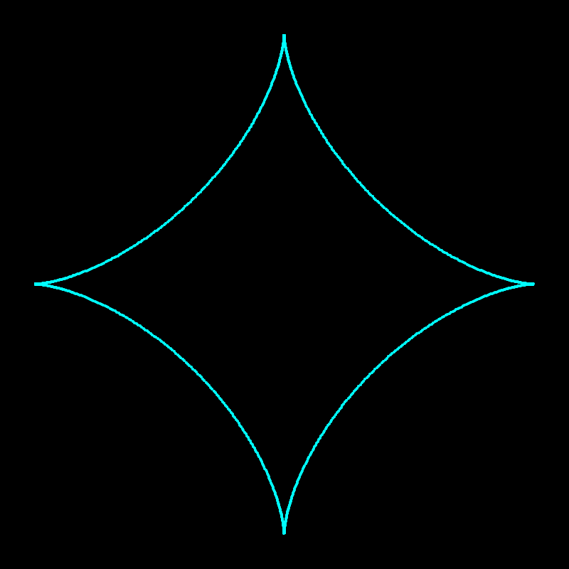

# termplotter
A command-line mathematical expression parser and plotter.

## Features

- Plot mathematical expressions with variables
- Support for user defined functions
- Support for parametric equations
- Multiple display options: ASCII, ANSI (colored), REGIS, Sixel
- File export: CSV, SVG, PPM, LaTeX


## Usage
> **Note:** For `sixel` and `regis` outputs we suggest using `xterm`. `xterm -ti vt340` does the trick for us

### Interactive Mode
```bash
cargo run
```

### Command Mode
```bash
cargo run -- "x^2 for x in -5:5"
cargo run -- "sin(x) for x in 0:6.28 with display=ansi"
```

## Examples

### Visual Gallery

Here are some beautiful mathematical curves generated with termplotter:

> **Note:** All example SVG files are generated and saved in the `examples/` directory.

#### Heart Curve
```bash
cargo run -- "(16*sin(t)^3, 13*cos(t) - 5*cos(2*t) - 2*cos(3*t) - cos(4*t)) for t in 0:6.28 with svg=examples/heart.svg"
```


#### Butterfly Curve
```bash
cargo run -- "(sin(t)*(exp(cos(t)) - 2*cos(4*t) - sin(t/12)^5), cos(t)*(exp(cos(t)) - 2*cos(4*t) - sin(t/12)^5)) for t in 0:75.4 with svg=examples/butterfly.svg"
```


#### Rose Curve
```bash
cargo run -- "(cos(5*t)*cos(t), cos(5*t)*sin(t)) for t in 0:6.28 with svg=examples/rose.svg"
```


#### Spiral
```bash
cargo run -- "(t*cos(t), t*sin(t)) for t in 0:25 with svg=examples/spiral.svg"
```


#### Sine Wave with Harmonics
```bash
cargo run -- "sin(x) + 0.5*sin(3*x) for x in 0:12.56 with svg=examples/sine_wave.svg"
```


#### Astroid
```bash
cargo run -- "(cos(t)^3, sin(t)^3) for t in 0:6.28 with svg=examples/astroid.svg"
```


#### Lissajous Curve
```bash
cargo run -- "(sin(3*t), cos(2*t)) for t in 0:6.28 with svg=examples/lissajous.svg"
```


#### 3D Surface Examples

termplotter supports 3D surface plotting using the syntax `f(x,y) for x in range for y in range`:

##### Paraboloid
```bash
cargo run -- "x^2 + y^2 for x in -2:2:48 for y in -2:2:48 with svg=examples/paraboloid_3d.svg"
```


##### Ripple Wave
```bash
cargo run -- "sin(sqrt(x^2 + y^2)) for x in -4:4:48 for y in -4:4:48 with svg=examples/ripple_3d.svg"
```


##### Saddle Surface
```bash
cargo run -- "cos(x) * sin(y) for x in -6:6:48 for y in -6:6:48 with svg=examples/saddle_3d.svg"
```


##### Gaussian Bell
```bash
cargo run -- "exp(-0.5*(x^2 + y^2)) for x in -3:3:48 for y in -3:3:48 with svg=examples/gaussian_3d.svg"
```


### Command Examples

  - Define constants
    `cargo run -- "a=3; b=2; a*x+b for t in 0:6.28"`

  - With functions
    `cargo run -- "f(x)=x^2; f(t)-f(f(t)) for t in -2:2"`
  
  - With step size
    `cargo run -- "(cos(t), sin(t)) for t in 0:6.28:0.1"`

  - Negative ranges
    `cargo run -- "(t, t^2) for t in -5:5"`

  - File input:
    - Read parameter values from file
        `cargo run -- "(cos(t), sin(t)) for t in data.txt"`

    - Use specific column from file
        `cargo run -- "(cos(t), sin(t)) for t in data.txt:2"`

  - ANSI (colored terminal):
    `cargo run -- "(cos(t), sin(t)) for t in 0:6.28 with display=ansi"`

  - REGIS (graphics terminal):
    `cargo run -- "(cos(t), sin(t)) for t in 0:6.28 with display=regis"`

  - Sixel (graphics protocol):
    `cargo run -- "(cos(t), sin(t)) for t in 0:6.28 with display=sixel"`
  
  - CSV data export:
    `cargo run -- "(cos(t), sin(t)) for t in 0:6.28 with csv=examples/circle.csv"`

  - SVG vector graphics:
    `cargo run -- "(cos(t), sin(t)) for t in 0:6.28 with svg=examples/circle.svg"`

  - PPM image:
    `cargo run -- "(cos(t), sin(t)) for t in 0:6.28 with ppm=examples/circle.ppm"`

  - LaTeX output:
    `cargo run -- "(cos(t), sin(t)) for t in 0:6.28 with latex=examples/circle.tex"`

  - Sixel graphics file:
    `cargo run -- "(cos(t), sin(t)) for t in 0:6.28 with sixel=examples/circle.six"`

  - REGIS graphics file:
    `cargo run -- "(cos(t), sin(t)) for t in 0:6.28 with regis=examples/circle.regis"`

  - 3D Surface plots:
    `cargo run -- "x^2 + y^2 for x in -2:2:48 for y in -2:2:48"`
    `cargo run -- "sin(x*y) for x in -3:3:48 for y in -3:3:48 with display=ansi"`
   
### Some Fun parametric curves
  - Circle
    `cargo run -- "(cos(t), sin(t)) for t in 0:6.28"`

  - Ellipse
    `cargo run -- "(2*cos(t), sin(t)) for t in 0:6.28"`

  - Heart shape
    `cargo run -- "(16*sin(t)^3, 13*cos(t) - 5*cos(2*t) - 2*cos(3*t) - cos(4*t)) for t in 0:6.28"`

  - Spiral
    `cargo run -- "(t*cos(t), t*sin(t)) for t in 0:12.56"`

  - Lissajous curve
    `cargo run -- "(sin(3*t), cos(2*t)) for t in 0:6.28"` 

  - Astroid
    `cargo run -- "(cos(t)^3, sin(t)^3) for t in 0:6.28"`

  - Butterfly curve
    `cargo run -- "(sin(t)*(exp(cos(t)) - 2*cos(4*t) - sin(t/12)^5), cos(t)*(exp(cos(t)) - 2*cos(4*t) - sin(t/12)^5)) for t in 0:75.4"`

  - Rose curve
    `cargo run -- "(cos(5*t)*cos(t), cos(5*t)*sin(t)) for t in 0:6.28"`

### Some Fun 3D surfaces
  - Paraboloid
    `cargo run -- "x^2 + y^2 for x in -2:2:48 for y in -2:2:48"`

  - Saddle
    `cargo run -- "x^2 - y^2 for x in -2:2:48 for y in -2:2:48"`

  - Ripple effect
    `cargo run -- "sin(sqrt(x^2 + y^2)) for x in -4:4:48 for y in -4:4:48"`

  - Gaussian bell
    `cargo run -- "exp(-0.5*(x^2 + y^2)) for x in -3:3:48 for y in -3:3:48"`

  - Sine wave product
    `cargo run -- "sin(x) * cos(y) for x in -6:6:48 for y in -6:6:48"

## Syntax
General syntax is as follows:

`(definition ';')*  plot_expression 'for' variable 'in' range ('with' display output* )?` 


`definition` can either be constant or function definitions. They end with `;`.
``` python
variable= 5; foo(x)= x+2; 
```

`plot_expressions` can be:
1. **Regular 1D functions** with one free variable
2. **Parametric 2D curves** as tuples  
3. **3D surfaces** with two free variables

Examples:
- Regular 1D
  ``` python
      exp(x) + max(f(x),g(x*y))
  ```

- Parametric 2D
  ``` python
  (sin(x), cos(x))
  ```

- 3D Surface  
  ``` python
  x^2 + y^2
  ```


`range` syntax:
- 1D/2D plots: `for variable in start:end` or `for variable in start:end:step`  
- 3D surfaces: `for x in start:end for y in start:end` (two ranges required)

`display` can be one of the following
 - `display=ascii`
 - `display=ansi`
 - `display=sixel`
 - `display=regis`

`output` can be one of the following
 - `csv=filename.csv`
 - `svg=filename.svg`
 - `ppm=filename.ppm`
 - `latex=filename.tex`
 - `sixel=filename.sixel`
 - `regis=filename.regis`
 


## Functions

### User-Defined

  You define your own constants and functions: 
  ``` python
  a=2; f(x)=x^2+1; f(a*x) for x in -5:5
  ```

  
### Unary Functions
  - Trigonometric:
    - `sin(x)`, `cos(x)`, `tan(x)`
    - `asin(x)`, `acos(x)`, `atan(x)`

  - Hyperbolic:
    - `sinh(x)`, `cosh(x)`, `tanh(x)`
    - `asinh(x)`, `acosh(x)`, `atanh(x)`

  - Logarithmic:
    - `ln(x)` 
    - `log10(x)`, `log2(x)`

  - Power/Root:
    - `sqrt(x)`, `cbrt(x)`, `exp(x)`

  - Special:
    - `erf(x)`, `erfc(x)`, `gamma(x)`
  
  - Rounding:
    - `floor(x)`, `ceil(x)`
    - `round(x)`
    - `fract(x)`
  
  - Utility
    - `abs(x)`
    - `recip(x)` -- 1/x
    - `signum(x)`
    - `todegrees(x)`, `toradians(x)`
    - `nextup(x)`, `nextdown(x)`
  
### Binary Functions

  - `x + y`, `x - y`, `x * y`, `x / y`, `x ^ y`
  - `-x`
  - `log(x, base)` 
  - `pow(x, y)` 
  - `hypot(x, y)`  Equivalent to `sqrt(x² + y²)`
  - `max(x, y)`, `min(x, y)`
  - `atan2(y, x)` 
  - `midpoint(x, y)`

### Ternary Functions
  - `clamp(x, min, max)` - constrain x between min and max
  
